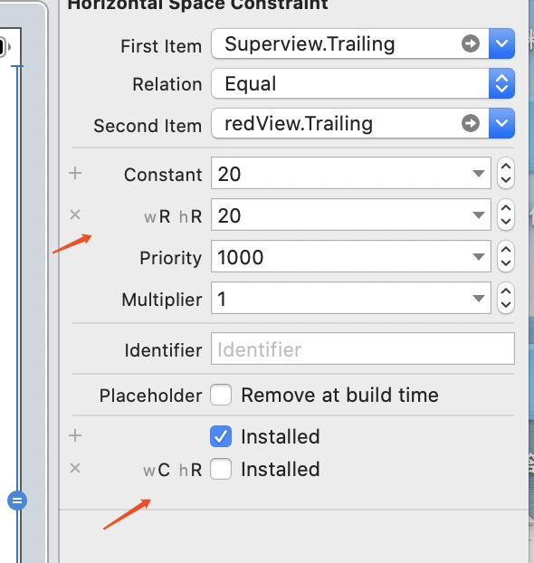
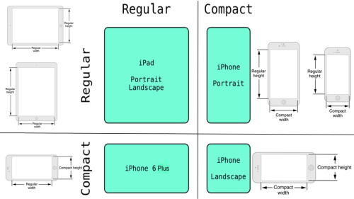
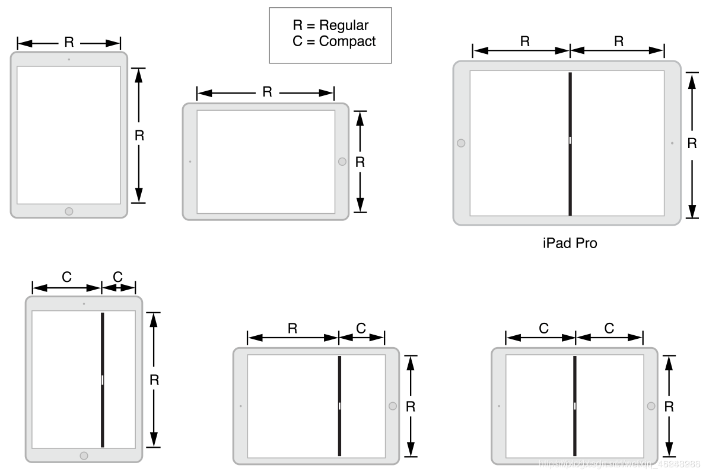

# ipadSplitStudy

## 分屏

分屏：两个App可以同时展示在界面上

**1.1分屏的条件**
1.必须是在iPad上，系统版本>=iOS9。
2.需要使用LaunchScreen.storyboard来做启动图（有验证）
3.iPad的打开“设置”>“常规”>“多任务”中的“滑动”和“拆分视图”

```swift
// 设备判断代码
if UI_USER_INTERFACE_IDIOM() == .Pad {}
```

**设备分屏变化的代理回调**

1.下面两个是**UIContentContainer** 里面的协议方法，当发生形变就会调用

```Swift
 // 分屏代理方法
    override func willTransition(to newCollection: UITraitCollection, with coordinator: UIViewControllerTransitionCoordinator) {
        super.willTransition(to: newCollection, with: coordinator)
      // 一般我在这个方法里面 remark 新的约束
      // 此时View 的frame还没发生变化
    }

    override func viewWillTransition(to size: CGSize, with coordinator: UIViewControllerTransitionCoordinator) {
        // 用Size 更新Frame
          
    }
    
```
2.traitCollectionDidChange 是**UITraitEnvironment**协议里面的，View和Controller 都遵循了，`区别1：`测试发现：9.7inch 横屏状态时1/3到半屏的切换不会调用该方法，竖屏4:6分屏切换时也不走，是因为此时horizontalSizeClass 为 C，verticalSizeClass为R 没有变化

`区别2：`当Push进入的时候会自动调用一遍traitCollectionDidChange方法,willTransition不会

```swift
    override func traitCollectionDidChange(_ previousTraitCollection: UITraitCollection?) {
        //更新Frame,调整位置
    }
```


##### 1.2 在布局之前先了解清一个重要的类 **UITraitCollection **

UIView /UIViewController/UIWindow 继承了**UITraitEnvironment**协议，在适配iOS13 有个`Dark Mode`的暗黑模式, 为了适配这个模式不得不在UIView和UIViewController以及UIWindow中复写traitCollectionDidChange 方法

```Swift
public protocol UITraitEnvironment : NSObjectProtocol {
    @available(iOS 8.0, *)
    var traitCollection: UITraitCollection { get }

    /** To be overridden as needed to provide custom behavior when the environment's traits change. */
    @available(iOS 8.0, *)
    func traitCollectionDidChange(_ previousTraitCollection: UITraitCollection?)
}
```

**userInterfaceIdiom**：设备类型

**layoutDirection**：布局方向

**图片 Scale 的配置**

```objective-c
+ (UITraitCollection *)traitCollectionWithDisplayScale:(CGFloat)scale;
@property (nonatomic, readonly) CGFloat displayScale; // unspecified: 0.0
```

**布局 Size Class 的配置**

```objective-c
+ (UITraitCollection *)traitCollectionWithHorizontalSizeClass:(UIUserInterfaceSizeClass)horizontalSizeClass;
@property (nonatomic, readonly) UIUserInterfaceSizeClass horizontalSizeClass; // unspecified: UIUserInterfaceSizeClassUnspecified
+ (UITraitCollection *)traitCollectionWithVerticalSizeClass:(UIUserInterfaceSizeClass)verticalSizeClass;
@property (nonatomic, readonly) UIUserInterfaceSizeClass verticalSizeClass; // unspecified: UIUserInterfaceSizeClassUnspecified

```

**Force Touch 是否可用的配置**

```objective-c
+ (UITraitCollection *)traitCollectionWithForceTouchCapability:(UIForceTouchCapability)capability API_AVAILABLE(ios(9.0));
@property (nonatomic, readonly) UIForceTouchCapability forceTouchCapability API_AVAILABLE(ios(9.0)); // unspecified: UIForceTouchCapabilityUnknown
```

displayGamut: 色域的配置

accessibilityContrast：是否开启高对比度的配置

`如果要在UIViewController中更新状态栏 当设置完style的时候可以调用`

```objective-c
[self setNeedsStatusBarAppearanceUpdate];
```


### 2. 常用的布局方式对比和举例

#### 2.1 Sb 中sizeclass 设置多套布局

用Sizeclass 在Xib中针对不同屏幕状态设置约束，这个不展开可以自行试一下



#### 2.2 使用Snapkit 或Mansory 进行约束布局

SnapKit 布局**,这个案例是针对水平方向宽度：C和R  布局，也可以针对1/3, 1/2,2/3 去单独约束，大部分情况下一个页面两种布局就够用，多了得思考一下UI的问题了。

```swift
import UIKit
import SnapKit

class TraitViewController: UIViewController {

    var view1:UIView = UIView()
    var view2:UIView = UIView()
    var view3:UIView = UIView()
    
  
   override func willTransition(to newCollection: UITraitCollection, with coordinator: UIViewControllerTransitionCoordinator) {
        self.layoutSubviews(newCollection: newCollection)
    }
    
    override func viewDidLoad() {
        super.viewDidLoad()
        
        self.view.addSubview(view1)
        view1.backgroundColor = UIColor.red
        view2.backgroundColor = UIColor.blue
        view3.backgroundColor = UIColor.yellow
        self.view.addSubview(view2)
        self.view.addSubview(view3)
        
        self.view.backgroundColor = UIColor.white
        self.view.traitCollection.
        self.layoutSubviews(newCollection: self.view.traitCollection)
    }

func layoutSubviews(newCollection: UITraitCollection) {
        let isCompactLayout = UIUserInterfaceSizeClass.compact == newCollection.horizontalSizeClass
        let margin:CGFloat = 20
        if isCompactLayout == true  {
            self.view1.snp_remakeConstraints { (make) in
                make.left.equalToSuperview().offset(margin)
                make.right.equalToSuperview().offset(-margin)
                make.top.equalToSuperview().offset(margin)
                make.bottom.equalTo(self.view2.snp_top).offset(-margin)
            }
            self.view2.snp_remakeConstraints { (make) in
                make.bottom.equalTo(self.view3.snp_top).offset(-margin)
                make.left.right.height.equalTo(self.view1)
            }
            self.view3.snp_remakeConstraints { (make) in
                make.bottom.equalToSuperview().offset(-margin)
                make.left.right.height.equalTo(self.view1)
            }
            
        }else {
            
            self.view1.snp_remakeConstraints { (make) in
                make.left.top.equalToSuperview().offset(margin)
                make.right.equalTo(self.view2.snp_left).offset(-margin)
                make.width.equalTo(self.view2.snp_width)
                make.height.equalTo(self.view2)
            }
            
            self.view2.snp_remakeConstraints { (make) in
                make.top.equalToSuperview().offset(margin)
                make.bottom.equalTo(self.view3.snp_top).offset(-margin)
                make.right.equalToSuperview().offset(-margin)
            }
            
            self.view3.snp_remakeConstraints { (make) in
                
                make.height.equalTo(self.view1)
                make.bottom.equalToSuperview().offset(-margin)
                make.left.equalToSuperview().offset(margin)
                make.right.equalToSuperview().offset(-margin)
            }
        }
}

```


#### 备注： iPad屏幕分辨率,分屏线占10pt

| 设备         | 尺寸      | 倍数 |
| :----------- | :-------- | :--- |
| iPad 7.9/9.7 | 768x1024  | @2x  |
| iPad 10.5    | 834x1112  | @2x  |
| iPad 12.9    | 1024x1366 | @2x  |

| 设备                 | 尺寸     | 倍数 | 比例       |
| -------------------- | :------- | :--- | ---------- |
| iPad 7.9/9.7 横屏 大 | 694x768  | @2x  | **0.6777** |
| iPad 7.9/9.7 横屏 中 | 507x768  | @2x  | **0.495**  |
| iPad 7.9/9.7 横屏 小 | 320x768  | @2x  | **0.3125** |
| iPad 7.9/9.7 竖屏 大 | 438x1024 | @2x  | **0.570**  |
| iPad 7.9/9.7 竖屏 小 | 320x1024 | @2x  | **0.4167** |
|                      |          |      |            |
| iPad 10.5 横屏 大    | 782x834  | @2x  | 0.703      |
| iPad 10.5 横屏 中    | 551x834  | @2x  | 0.495      |
| iPad 10.5 横屏 小    | 320x834  | @2x  | 0.2878     |
| iPad 10.5 竖屏 大    | 504x1112 | @2x  | 0.604      |
| iPad 10.5 竖屏 小    | 320x1112 | @2x  | 0.384      |
|                      |          |      |            |
| iPad 12.9 横屏 大    | 981x1024 | @2x  | 0.718      |
| iPad 12.9 横屏 中    | 678x1024 | @2x  | 0.496      |
| iPad 12.9 横屏 小    | 375x1024 | @2x  | 0.2745     |
| iPad 12.9 竖屏 大    | 639x1366 | @2x  | 0.624      |
| iPad 12.9 竖屏 小    | 375x1366 | @2x  | 0.366      |




下面的图对设置约束还是蛮重要的Pro和半屏也是R：



示例代码：[Demo](https://github.com/YFBig-Heart/ipadSplitStudy)

参考链接

https://www.jianshu.com/p/107eaa5fbccc

[UITraitCollection详解]( https://www.jianshu.com/p/36035f5b8feb)

[WWDC15 Session笔记 - iOS 9 多任务分屏要点](https://onevcat.com/2015/06/multitasking/)

[Slide Over & Split View Quick Start](https://developer.apple.com/library/prerelease/ios/documentation/WindowsViews/Conceptual/AdoptingMultitaskingOniPad/QuickStartForSlideOverAndSplitView.html#//apple_ref/doc/uid/TP40015145-CH13-SW1)

参考代码：

https://github.com/wangzzcloud/PadSupportComponent

